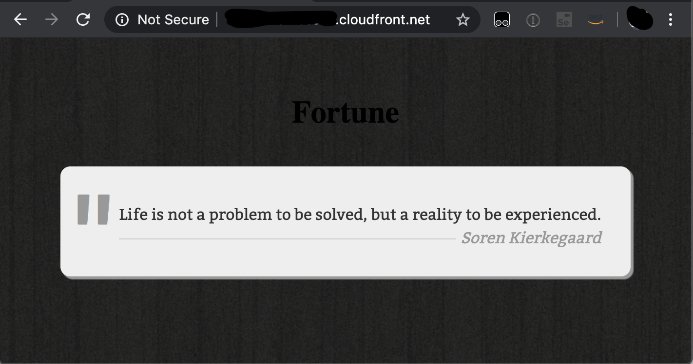
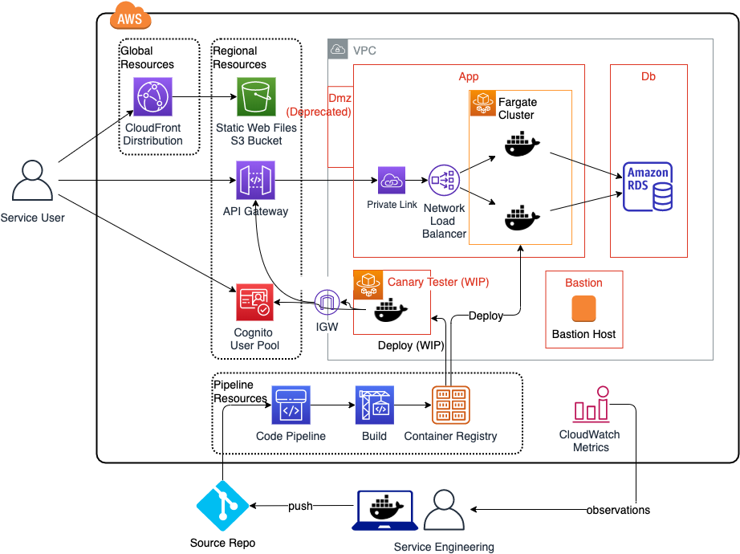

# Fortune 

Aka: Yet Another Demo App ("YADA?")

To illustrate and communicate Infrastructure-as-Code and DevOps practices, through a very simple random quote API.

 


## Infrastructure Setup

 


### Prereqs

* Use a shell environment, such as MacOS, Bash for Windows, or AWS Cloud9.
* Install prerequisites ```jq```, ```aws cli```, ```make```. ```mysql```

### 0. Configuration parameters

Update [config/config.env](config/config.env) with desired parameters.

### 1. VPC Network

Deploy Cloudformation stack to create a VPC (Virtual Private Cloud). Contains:
* 2 public Subnets, 
* 2 private Subnets, 
* 1 NAT Gateway, 
* 4 Security Groups, for Bastion, DMZ (DEPRECATED), Application, and Database, (and Canary TODO)

```
cd 01-vpc
make validate && make deploy
```

### 2. Bastion Host

Create 1 Bastion EC2 host into a public subnet, Bastion security group. Amazon Linux configured with SSM and CloudWatch agent.

```make init``` is required to initialize configuration parameters.

```
cd ../02-bastion
make validate && make init && make deploy
```

### 3. RDS Database 

1. Create an RDS Aurora MySQL serverless cluster inside a private subnet. 
```make init``` is required (again) to initialize configuration parameters.

```
cd ../03-database
make validate && make init && make deploy
```

Please wait for the RDS MySQL database creation to complete, before proceeding to load data.

2. Load sample data. Again, call ```make init``` to init the database endpoint.

```
make init && make load && make test
```
Accept any SSH prompts if its the first time connecting to the bastion host.

> Verify the following console output is returned, indicating the number of sample data rows created in the ```quotes``` table.
>
>```
>COUNT(1)
>75966
>```
>
>> Credits: Sample quotes sourced from [https://raw.githubusercontent.com/akhiltak/inspirational-quotes/master/Quotes.csv]

### 4. Container Cluster

1. Deploy Fargate cluster and sample app.

```
cd ../04-fargate
make validate && make init && make deploy

```

What this creates: 
* ECS cluster, 
* Load Balancer, 
* Fargate service that runs a sample Nginx image

>Verify the sample Nginx home page:
>Get the public load balancer DNS endpoint (see stack output). 
>Verify in a browser to view the Nginx default welcome web page.

2. Create the private ECR Container Registry

```
make create-repo
```

### 5. Quotes Application.

Build the fortune application image. Publish to ECR.

1. Start Docker desktop. Build docker image.

2. Start a tunnel to the database, build and run the container locally

```
cd ../05-fortune
make clean
make build
make db-tunnel
make run
# if successful, should print "Hello, Fortune!"
make stop
```

3. Push the __"fortune"__ container image to the repo

```
make push
```

4. Update the cloudformation template with the updated container image.

```
cd ../04-fargate
make init
make deploy

```

When deployment completes, the load balancer default fortune message appears.

```
$ curl <API_ENDPOINT>
```

You should see a successful quote in the JSON response. E.g.
```
{
    "Id": 57008,
    "Quote": "Too many problem-solving sessions become battlegrounds where decisions are made based on power rather than intelligence.",
    "Author": "Margaret J. Wheatley",
    "Genre": "power"
}
```

> **Troubleshooting**: If you see a response like this:
```Hello, Fortune!
```
Thats the default response when the fortune container is unable to connect to the database. Check the logs and Parameter Store settings.

### 6. Edge 

Deliver the service to users via edge services, via the Cloudfront CDN, a static  

```
cd ../06-edge
make init
make validate
make deploy
make upload
```

Open a browser to the Cloudfront URL. It loads and renders the fortune quote.

 

> **Troubleshooting**: use HTTP (not TLS) since the page makes a CORS call to the Fortune API which does not have a SSL Certificate at this time, so the browser requires both the Origin web page and the API it calls, to both use the same protocol.


### 7. Application Pipeline.

1. Create the CodePipeline stack. 

```
cd ../07-pipeline
make verify
make deploy
```

2. Authorize the pipeline to trigger from your source repository.

After the stack deployment completes, authorize the pipeline to connect to your repository, i.e. your clone of this sample repository.

* Navigate to the CodeDeploy pipeline. Notice the `Source` step has failed, lets fix it.
* On the Pipeline, click 'Edit'
* On the Stage 'Edit:Source', click 'Edit stage'
* On the Action 'GitHub', click the 'edit' pencil icon
* Click 'Connect to GitHub' to Grant AWS CodePipeline access to your GitHub repository.
* Select your Repository and Branch.
* Click 'Done', click 'Save' pipeline changes.


### 8. Authentication

1. Deploy Cognito stack. Create a test user.

```
cd ../08-auth
make verify
make deploy
make create-test-user
make test-auth
```

2. Configure Cognito User Pool domain.

```
make init
make create-user-pool-domain
```

3. Configure App Client Settings

Configure the app client to use the built-in webpages for signing up and signing in users:

```
make config-app-client
```
Verify the hosted UI, from the AWS Console:

Cognito UserPool -> App integration -> App client settings -> App client -> Hosted UI.

https://sandbox00-fortune.auth.ap-southeast-1.amazoncognito.com/login?client_id=6cfa6ajrrpla0nfkn6g8ijeb4h&response_type=token&scope=openid&redirect_uri=https://d1nhf019mossk5.cloudfront.net/


4. Configure SSL on the Load Balancer.

> Caveat: (TODO)
> 
> * Tested on: ACM certificate validated against valid Route53 DNS domain.
> * Not tested: self-signed SSL cert imported into ACM

    * Configure Route53 domain
    * Generate ACM wildcard certificate
    * Create Load Balancer HTTPS listener.

5. Configure API Authentication from the Load Balancer

TODO: add description.

6. Configure javascript auth on web page.

TODO: add auth on web page. Should use Amplify? What client-side library to use?


## TODOs

* Secrets Manager credentials requires Lambda function for cred rotation.

#### Systems Manager section below (please ignore)

TODO section to potentially use EC2 SSM instead of SSH. E.g. for populating sample data. Please ignore, for now.

```
# Run a command via SSM
aws ssm send-command --instance-ids ${EC2_INSTANCE} --document-name "AWS-RunShellScript" --comment "IP config" --parameters commands=ifconfig --output text

# Run a script via SSM (TODO)
aws ssm send-command --instance-ids ${EC2_INSTANCE} --document-name "AWS-RunRemoteScript" '--comment "remote script" --parameters sourceType= sourceInfo='{"path":"https://s3.amazonaws.com/path_to_script"}'
 commandLine="pythonMainFile.py argument1 argument2"
```
